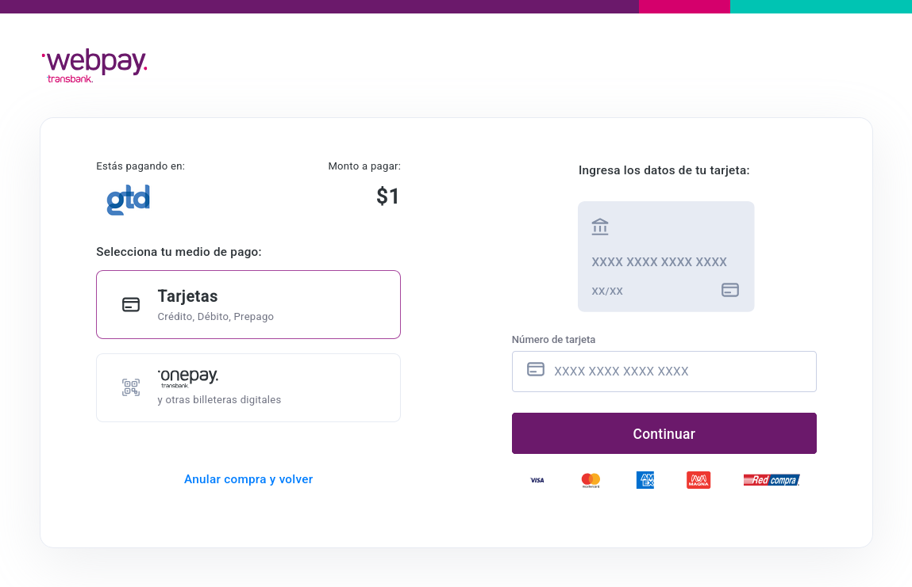

# Faster Webpay userscript

This page requires you to alternate 4 times between mouse and keyboard usage:

This userscript auto-clicks everything so you can use the page with just 23 keystrokes (16 for card number, 4 for expiration and 3 for CVV)

## Installation

1. [Install Violentmonkey](https://violentmonkey.github.io/get-it/)
2. Go [here](https://raw.githubusercontent.com/zzdroide/FasterWebpay/main/FasterWebpay.user.js) and click Install.

## Code security

As this script targets specifically a web page in which you enter your debit/credit card data, the code has been optimized for legibility so you can review it before installing it.

It has one `@require` from violentmonkey themselves, for simpler code as recommended in their [guide](https://violentmonkey.github.io/guide/observing-dom/).
